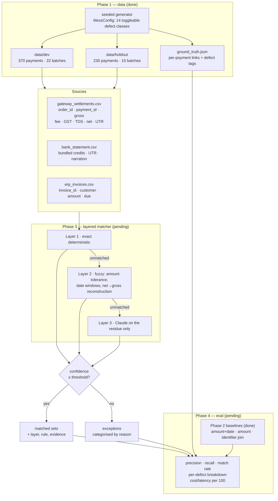

# Multi-Source Reconciliation Agent

Razorpay AI Buildathon — Track 04 (AI Finance Controller).

Reconciles three sources that legitimately disagree — a Razorpay-style gateway
settlement report, a bank statement of bundled credits, and an invoice/ERP
ledger — into matched sets with evidence, plus an honest exception list.

**Status: Phases 1–2 complete (data + scored deterministic baselines). Phases 3–5 pending.**

## Architecture



## Phase 1 — synthetic data

`make data` regenerates everything from seed 42 and fails if any invariant breaks.

| | dev | held-out |
|---|---:|---:|
| payments | 370 | 230 |
| settlement batches | 22 | 15 |
| gateway rows | 431 | 262 |
| bank rows | 28 | 17 |
| invoice rows | 361 | 221 |

600 payments total. Config hash `c8f85c417735e8a4`.

### Design decisions

**Integer paise everywhere.** Rupee decimals exist only at the CSV boundary,
parsed through `Decimal`. Floats manufacture exactly the sub-paise error the
project exists to measure.

**The split is at settlement-batch level, not payment level.** A batch
straddling the split would leak held-out structure into dev and make
many-to-one matching untestable, since dev would hold a partial view of a
held-out bank credit. Batches joined by a split settlement stay together as one
component. Because components are indivisible, the realised split is 370/230
rather than exactly 400/200.

**The split is stratified on batch-level defect mix.** Balancing payment count
alone produced a held-out set with 28% of payments riding a chargeback batch
against dev's 9%, and *zero* corrupted narrations in dev. A held-out score under
a materially different defect mix is not a fair comparison. The stratified split
holds every payment-level defect within 2.3 percentage points across the two
sets.

**Payment-level and batch-level defects are counted separately.** A phantom
duplicate refund breaks the tie-out for every payment in its batch, so folding
the two together reported "22% of payments have a duplicate refund" — true in
the *affected-by* sense, misleading as a prevalence. Ground truth carries
`defect_tags` (the payment's own) and `bundle_defect_tags` (its batch's) as
separate fields.

**Repeated price points are deliberate.** 20% of payments draw from a small set
of list prices (₹499 … ₹19,999), so identical amounts recur on the same day.
This is what defeats amount-only matching in real books, and it is what will
make the Phase 2 baseline fail honestly rather than by accident.

### Defect classes

All 14 are independently toggleable (`recon generate --disable tds`) and
independently proportioned. Every one is asserted present by
`check_defect_coverage`, so a silently-zero class cannot slip through and make
the per-defect breakdown lie by omission.

Payment-level (denominator: payments, dev / held-out):

| defect | dev | held-out |
|---|---:|---:|
| `tds_deducted` | 13.8% | 14.8% |
| `paise_drift_row` | 13.8% | 12.2% |
| `erp_link_broken` | 8.6% | 9.6% |
| `split_settlement` | 5.7% | 5.7% |
| `refund_full` / `refund_partial` | 3.8% / 3.0% | 2.2% / 4.3% |
| `tz_boundary` | 3.2% | 3.5% |
| `invoice_amount_mismatch` | 3.2% | 3.0% |
| `unresolvable_no_invoice` | 1.6% | 3.9% |
| `unresolvable_orphan_order_id` | 1.9% | 0.9% |
| `unresolvable_no_bank_credit` | 1.1% | 1.7% |
| `duplicate_refund` | 1.1% | 0.4% |

Batch-level (denominator: batches; payments riding them in brackets):

| defect | dev | held-out |
|---|---:|---:|
| `bundled_payout` | 22/22 (100%) | 15/15 (100%) |
| `weekend_holiday_drift` | 8/22 (45%) | 4/15 (47%) |
| `narration_corrupt` | 7/22 (27%) | 3/15 (27%) |
| `chargeback_adjustment` | 4/22 (13%) | 2/15 (19%) |
| `paise_drift_bundle` | 5/22 (13%) | 1/15 (2%) |

Roughly 5% of payments are **genuinely unresolvable** and must land in
exceptions: no ERP counterpart, no `order_id` and no invoice hint, or a
settlement that was never credited. A confident match on one of these is a
false positive, not a win.

### How the mess is modelled

- **Rounding drift** is not random noise. Drifted rows are priced with banker's
  rounding instead of half-up, so the row stays internally consistent and the
  bank still ties — but a matcher reconstructing gross from net under a half-up
  assumption is off by a paisa. Batch-level drift (bank truncation) is separate
  and does break the tie-out, forcing an explicit tolerance.
- **Timing drift** follows the RBI calendar: Sundays, 2nd and 4th Saturdays, and
  gazetted holidays. T+2 from Friday 23 Jan 2026 lands on Wednesday 28 Jan —
  five calendar days of entirely legitimate drift.
- **Split settlements** emit a second gateway row carrying the deferred balance
  with no fee of its own, the way an on-hold release actually appears.
- **Phantom duplicate refunds** show the refund twice in the report while the
  bank moved the money once, so naive summation double-counts.
- **Narration corruption** comes in three modes: UTR only in the narration
  string, UTR truncated, or the structured column disagreeing with the
  narration. These are the main driver of Layer-3 residue.
- **Noise bank credits** are not settlements at all and must be rejected.

### Not tuning on held-out

The held-out set is protected by build rules, not by promises:

1. `tests/test_holdout_guard.py` fails if any module outside the evaluation
   harness so much as names the held-out split, and if any matcher module
   touches the filesystem at all.
2. Every split carries a `manifest.json` with the seed and a SHA-256 of the
   generator config. Tuning the generator against held-out results would change
   that hash, visibly, in git history.
3. Matching layers take parsed records as arguments and return values. They have
   no I/O, which is also what makes them unit-testable as pure functions.

## Phase 2 — deterministic baseline

`make baseline` reproduces every number below. Three baselines, all with zero
tunable parameters — no tolerances, no windows, no thresholds — which is why
running them on the held-out set is not a form of peeking.

All three use the rule **unique exact match**: zero candidates is an exception,
and so is more than one. Picking arbitrarily among equal candidates would
inflate the match rate with coin flips and destroy precision, which would
flatter the layered matcher for the wrong reason.

### Results

Held-out (230 payments, 15 batches):

| baseline | bank P | bank R | invoice P | invoice R | **fully reconciled** | 95% CI | hallucinations |
|---|---:|---:|---:|---:|---:|---:|---:|
| `amount + date` (as specified) | 0.0% | 0.0% | 70.0% | 6.4% | **0.4%** | 0–2% | 0 |
| `amount only` | 0.0% | 0.0% | 100.0% | 71.2% | **1.7%** | 1–4% | 0 |
| `identifier join` | 100.0% | 72.3% | 100.0% | 90.0% | **65.7%** | 59.3–71.5% | 0 |

Dev (370 payments, 22 batches):

| baseline | bank P | bank R | invoice P | invoice R | **fully reconciled** | 95% CI |
|---|---:|---:|---:|---:|---:|---:|
| `amount + date` | 0.0% | 0.0% | 71.4% | 7.0% | **0.3%** | 0–2% |
| `amount only` | 0.0% | 0.0% | 100.0% | 70.6% | **0.5%** | 0–2% |
| `identifier join` | 100.0% | 71.7% | 100.0% | 91.0% | **66.5%** | 61.5–71.1% |

**The number to beat is 65.7% fully reconciled on held-out**, not 0.4%. More on
that below.

### Why the specified baseline scores zero on the bank leg

Not a bug, and not a weak implementation — it is structural. One bank credit
covers 4 to 60 payments, so no individual payment's net settled amount is ever
equal to a bank credit. Exact amount matching on the bank leg cannot work in
principle, and that is the central finding the whole project is built around.

Reporting only that would be setting up a strawman, so two stronger baselines
are reported alongside it. `amount only` drops the date predicate — closer to
what a finance team actually does in a spreadsheet. `identifier join` does what
a competent controller does first: join the settlement UTR to the bank
statement's UTR column, and the ERP's `order_id` to the gateway's. **That is
the honest number to beat**, and quoting the 0.4% figure as "the baseline" while
knowing the identifier join exists would be misleading.

### Metric definitions

- **Edges, not payments, are the unit of precision and recall.** One payment can
  legitimately belong to two bank credits (a split settlement), so payment-level
  scoring would force an all-or-nothing verdict on 5.7% of the corpus. An edge
  is one `(payment, counterpart)` pair.
- **Fully reconciled** is the headline: both legs simultaneously correct, where
  a correctly *empty* prediction on an unresolvable payment counts as correct.
  This is what a controller means by reconciled — half a payment is not
  reconciled, and correctly refusing to match an unresolvable record is a right
  answer, not a gap in coverage.
- **Hallucination is measured separately** from precision. Roughly 5% of
  payments have no counterpart at all. Confidently matching one of those is not
  a small precision loss — it silently closes a real discrepancy. All three
  baselines score 0, which is expected: an exact matcher cannot hallucinate.
- **Every rate carries a Wilson interval.** At 230 held-out payments the point
  estimates are not precise, and quoting them bare would overstate what the
  evaluation supports.

### Where the strongest baseline loses

Failures attributed by defect tag (held-out, `identifier join`):

| leg | misses | cause |
|---|---:|---|
| bank | 62 | **61 of 62 are `narration_corrupt`** — every single payment riding a batch with a corrupted narration fails |
| invoice | 22 | **22 of 22 are `erp_link_broken`** — every single payment with a broken ERP link fails |

Nothing else is causal. Weekend drift, TDS, paise drift, duplicate refunds and
chargebacks all appear in the miss list only because they co-occur with those
two — an identifier join is structurally immune to every one of them. This is
what the per-defect breakdown is for, and it defines Phase 3's job precisely:

1. **Layer 2** recovers UTRs from narration text (parse, then fuzzy-match
   transposed and truncated digits) and repairs broken ERP links (typo'd,
   case-shifted, or absent `order_id`, falling back on amount and customer).
2. **Layer 3** takes only what is left: batches where no UTR is recoverable at
   all and the set has to be reconstructed from amounts, and genuinely ambiguous
   many-to-one cases.

### Known weakness carried into Phase 3

Orphan-counterpart precision is poor — 0.50 on bank credits and 0.08 on
invoices held-out. Recall is 1.00, so no genuine orphan is missed, but the
"unmatched counterpart" list is mostly real records the baseline simply failed
to match. This is the flip side of low recall and should improve as recall
does; Phase 4 will track it rather than let it hide.

## Reproduce

```bash
make install      # uv venv on Python 3.12 + editable install
make data         # regenerate both splits from seed 42, verify all invariants
make data-report  # defect mix per split
make baseline     # run and score the three deterministic baselines
make check        # ruff + mypy --strict + pytest
```

100 tests currently pass; `mypy --strict` is clean across all source modules.
Scorecards are written to `reports/scorecards_{dev,holdout}.json`.

## Limitations

- **The held-out set is small.** 230 payments across 15 batches. Batch-level
  metrics will move in ~7% steps and a single bad batch swings the headline
  number. Phase 4 will report Wilson confidence intervals on every rate rather
  than quoting point estimates as if they were precise.
- **`tds` is a column, not an adjustment row.** Real Razorpay settlement reports
  surface 194-O TDS as a separate adjustment entry, not as a field on the
  payment row. The brief asks for TDS mid-flow, so it is modelled as a column.
  This makes net→gross reconstruction cleaner to test and slightly easier than
  reality.
- **`chargeback_adjustment` was raised from 2% to 12% of batches** and
  `narration_corrupt` from 10% to 25%. At the realistic rates these produced
  fewer than one case in 37 batches — unmeasurable, and therefore useless for a
  per-defect breakdown. Prevalence is traded for measurability, deliberately.
- **The 2026 bank-holiday list is illustrative.** State holidays vary by region
  and lunar dates shift; the list is fixed so generation stays reproducible.
- **One universe, split two ways** — dev and held-out are not independent draws.
  They share customers and the same generator parameters, so held-out measures
  generalisation to unseen *records*, not to an unseen *merchant*.
- **Defects compound.** A payment can carry several tags at once. Phase 4 will
  report both marginal prevalence (all records carrying a tag) and isolated
  prevalence (that tag alone), because a marginal-only breakdown is confounded.
- **The baselines were scored on held-out data.** This is safe only because they
  have no parameters to tune; the same will not be true of Layer 2, whose
  tolerances and windows will be fixed on dev before held-out is touched.
- **The defect attribution above is marginal, not causal.** It reads clearly
  here only because the identifier join fails on exactly one defect class per
  leg. Phase 4 needs the isolated-tag view for cases where it does not.
