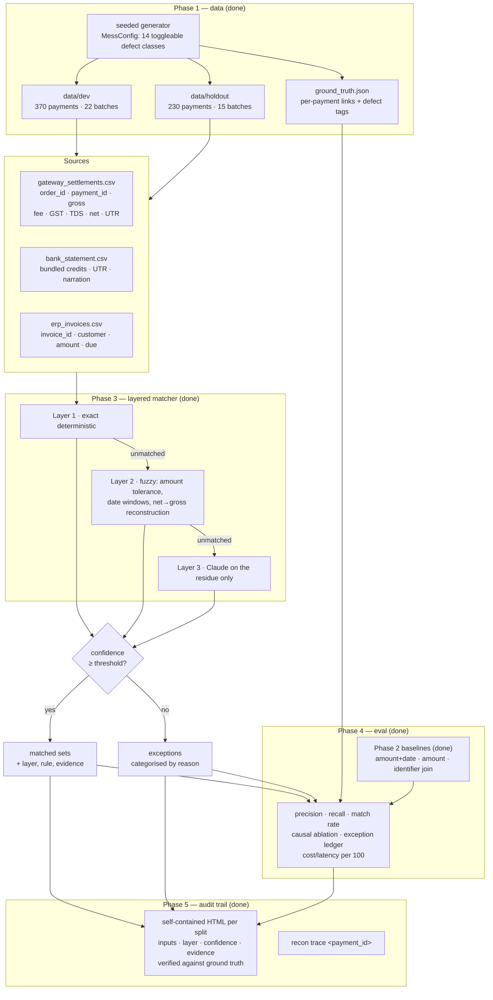

# Multi-Source Reconciliation Agent

Razorpay AI Buildathon — Track 04 (AI Finance Controller).

Reconciles three sources that legitimately disagree — a Razorpay-style gateway
settlement report, a bank statement of bundled credits, and an invoice/ERP
ledger — into matched sets with evidence, plus an honest exception list.

**Status: all five phases complete. Layer 3 is built and unit-tested but has not
yet been run live — no API credentials in this environment, so every measured
number below is Layers 1–2.**

## Architecture




## How it works

### Data (Phase 1)

600 payments across three sources that legitimately disagree, with a
per-payment ground-truth mapping. Seventeen defect classes, each independently
toggleable and independently proportioned — which is what makes the causal
ablation in the results possible at all.

**Integer paise everywhere.** Rupee decimals exist only at the CSV boundary,
parsed through `Decimal`. Floats manufacture exactly the sub-paise error the
project exists to measure.

**Rounding drift is a rounding-*mode* disagreement, not noise.** Drifted rows
are priced with banker's rounding instead of half-up, so the row stays
internally consistent and the bank still ties — it only bites a matcher
reconstructing gross from net under a half-up assumption. Batch-level drift
(bank truncation) is a separate class and does break the tie-out.

**Timing follows the RBI calendar** — Sundays, 2nd and 4th Saturdays, gazetted
holidays. T+2 from Friday 23 Jan 2026 lands on Wednesday 28 Jan: five calendar
days of entirely legitimate drift.

**Repeated price points are deliberate.** A fifth of payments draw from a small
set of list prices, so identical amounts recur on the same day. That is what
defeats amount-only matching in real books, and it is why the specified
baseline fails for the right reason rather than by accident.

**The split is at settlement-batch level and stratified on defect mix.**
A batch straddling the split would leak held-out structure into dev and make
many-to-one matching untestable. Balancing payment count alone produced a
held-out set with three times dev's chargeback exposure and zero corrupted
narrations in dev. Batches are indivisible, so the realised split is near, not
exactly, 400/200 — the generated Corpus table above states what was produced.

**The corpus was hardened after Phase 3 began.** On the first corpus, Layers
1–2 alone reached 98.7% and Layer 3 inherited a residue of one record. That was
a data failure, not a matcher success: every defect had an exact deterministic
inverse, because the corruption and its cure were designed by the same hand.
Three classes with no mechanical inverse were added — `narration_opaque`,
`unexplained_deduction`, `duplicate_customer_invoice` — with opacity and
deductions *correlated* rather than independent, since both follow from a
payout leaving the normal automated path. Modelled independently the genuinely
hard case occurred about 4% of the time, too rare to measure. The previous
corpus and its scores are in git history, not quietly overwritten.

### Baselines (Phase 2)

Three, all with zero tunable parameters, which is why scoring them on held-out
data is not a form of peeking.

`amount + date` is the baseline the brief specifies. Its bank leg scores zero,
and that is structural rather than a weak implementation: one credit covers 4
to 60 payments, so no single payment's net ever equals a credit. Exact amount
matching on that leg cannot work in principle.

Reporting only that would be a strawman, so `identifier join` — UTR to the bank
statement's UTR column, ERP `order_id` to the gateway's — is reported as **the
number to beat**. It is what a competent controller does first.

All three use *unique* exact match: zero candidates is an exception and so is
more than one. Guessing among equal candidates would inflate the match rate
with coin flips and flatter the layered matcher for the wrong reason.

### Layered matcher (Phase 3)

**Layer 1 — exact.** UTR and `order_id` joins, resolved at settlement-batch
level and propagated to every payment in the batch. The bank leg is a
batch-level problem; asking the same many-to-one question up to sixty times
would invite the layers to disagree with themselves.

**Layer 2 — fuzzy.** Nine rules tried in descending order of reliability; the
first yielding exactly one unclaimed candidate wins. A rule finding several
candidates falls through rather than guessing. Every tolerance was **measured
on dev** — invoice issue-to-capture lag p99 = 12 days → a 14-day window; worst
batch amount residual = 5 paise → a 10-paise tolerance — never guessed and
never read off the generator.

**Layer 3 — Claude on the residue only.** What reaches it is batches whose bank
credit carries no reference of any kind *and* whose total does not tie because
of an unitemised deduction. Three rules govern it: declining is a correct
answer, stated in the prompt and a first-class `null` in the schema; its
confidence is capped at 0.85× whatever it reports, so it can never outrank a
rule whose precision was measured; and a chosen id outside the offered
candidate list is treated as a decline, not trusted.

Output is constrained by `output_config.format` at generation time *and*
re-validated locally with pydantic, so anything that slips through becomes a
typed `llm_schema_invalid` exception rather than a bad match.

**A counterpart can only be claimed once**, on every layer. A credit belongs to
one batch and an invoice to one payment; letting two subjects claim the same
record buys a recall point at the cost of a precision loss on both.

### Evaluation (Phase 4)

**Edges, not payments, are the unit of precision and recall.** A split
settlement legitimately maps one payment to two credits, so payment-level
scoring would force an all-or-nothing verdict on part of the corpus.
Payment-level exact resolution is reported alongside, since that is what a
controller actually cares about.

**Hallucination is measured separately from precision.** Confidently matching
one of the payments that have no counterpart silently closes a real
discrepancy. That is categorically worse than an ordinary precision miss, so it
gets its own row.

**The per-defect table is observational and says so.** Batch-level defects
attach to every payment in their batch, so classes co-occur constantly and the
isolated view is empty for most of them. The **causal ablation** is the real
answer: each class is switched off in the generator, the corpus regenerated and
the matcher re-run, paired per seed and averaged over eight seeds, with a
standard error so a delta smaller than reshuffling noise is visible as such.
Ablations run on the dev distribution only.

**Every rate carries a Wilson interval**, because the held-out set is small
enough that bare point estimates would overstate what the evaluation supports.

**The results block is generated, not typed.** `make eval` regenerates the data,
re-runs everything and rewrites the block between the markers; `make eval-check`
fails the build if the committed README is stale. Numbers in the prose would
rot; there are none.

### Audit trail (Phase 5)

`make audit` writes `reports/audit_{dev,holdout}.html` — one self-contained page
per split. CSS and JS are inlined and there are no CDN references, so it opens
straight from the filesystem, survives being emailed, and honours the project's
no-network rule.

Every asserted match expands to show the gateway payment, the bank credit or
invoice it was tied to, the layer and rule that made the call, the confidence,
and the evidence in plain English — for example *"narration carries
SBIN99658578, a prefix of SBIN996585783756"*. The exception queue does the same
for everything left open.

Rendered in evaluation mode the page checks every row against ground truth and
labels it, because a demo that shows matches without showing which ones are
wrong is asking to be taken on trust. Three verdicts, not two:

- **correct** — the asserted set equals ground truth
- **partial** — every asserted edge is right but the set is incomplete, which
  happens when one leg of a split settlement ties and the other does not.
  Calling that "wrong" would contradict the edge-level precision the scorecard
  reports and overstate the error, since nothing false was asserted
- **wrong** — at least one asserted edge is not in ground truth

`recon trace <payment_id>` prints the same trail for a single payment in the
terminal, which is the fastest way to interrogate a specific disagreement.

### Not tuning on held-out

Three build rules, not promises:

1. `tests/test_holdout_guard.py` fails if any module outside the evaluation
   harness references the held-out split by path or name, and if any matcher
   module touches the filesystem at all.
2. Each split carries a manifest with the seed and a hash of the generator
   config. Tuning the generator against held-out results changes that hash,
   visibly, in git history.
3. Matching layers take parsed records as arguments and return values. They
   have no I/O, which is also what makes them unit-testable as pure functions.

Layer 3's transcript is recorded on **dev only** (`make record-llm`), and
`make eval` replays it. A live model is non-deterministic and costs money, so a
README claiming reproducible numbers while calling an API on every run would be
claiming something untrue. Replay is keyed by a hash of (model, system prompt,
user prompt): change a prompt and the transcript misses loudly rather than
serving a stale answer.


<!-- BEGIN GENERATED: results -->

## Results

Everything below is generated by `make eval` — commit `5c8839d`, confidence threshold 0.70, Layer 3 mode `replay`. Do not edit by hand; `recon eval --check` fails when this block is stale.

### Corpus

| split | payments | batches | gateway rows | bank rows | invoices |
|---|---:|---:|---:|---:|---:|
| dev | 380 | 25 | 444 | 31 | 391 |
| holdout | 220 | 12 | 249 | 14 | 223 |

Seed `42`, generator `1.0.0`, config hash `8e3f18b579291d2d`.

### Defect mix

Payment-level, as a share of that split's payments:

| defect | dev | holdout |
|---|---:|---:|
| `duplicate_customer_invoice` | 17 (4.5%) | 15 (6.8%) |
| `duplicate_refund` | 4 (1.1%) | 1 (0.5%) |
| `erp_link_broken` | 26 (6.8%) | 16 (7.3%) |
| `invoice_amount_mismatch` | 16 (4.2%) | 4 (1.8%) |
| `paise_drift_row` | 57 (15.0%) | 22 (10.0%) |
| `refund_full` | 13 (3.4%) | 6 (2.7%) |
| `refund_partial` | 12 (3.2%) | 9 (4.1%) |
| `split_settlement` | 29 (7.6%) | 11 (5.0%) |
| `tds_deducted` | 48 (12.6%) | 37 (16.8%) |
| `tz_boundary` | 11 (2.9%) | 9 (4.1%) |
| `unresolvable_no_bank_credit` | 4 (1.1%) | 4 (1.8%) |
| `unresolvable_no_invoice` | 5 (1.3%) | 10 (4.5%) |
| `unresolvable_orphan_order_id` | 5 (1.3%) | 4 (1.8%) |

Batch-level, as batches carrying the defect and the payments riding them:

| defect | dev | holdout |
|---|---:|---:|
| `bundled_payout` | 25/25 (100% of payments) | 12/12 (100% of payments) |
| `chargeback_adjustment` | 4/25 (11% of payments) | 2/12 (24% of payments) |
| `duplicate_refund` | 5/25 (33% of payments) | 1/12 (2% of payments) |
| `narration_corrupt` | 4/25 (23% of payments) | 2/12 (22% of payments) |
| `narration_opaque` | 6/25 (20% of payments) | 3/12 (28% of payments) |
| `paise_drift_bundle` | 5/25 (10% of payments) | 1/12 (5% of payments) |
| `unexplained_deduction` | 6/25 (19% of payments) | 4/12 (40% of payments) |
| `weekend_holiday_drift` | 8/25 (43% of payments) | 4/12 (50% of payments) |

Largest batch-level mix gap: `duplicate_refund` rides 33% of dev payments against 2% of holdout, making **dev the harder split** on that defect. The split is stratified on batch counts, which does not equalise payment shares when a defect lands on larger batches.

### Baseline vs. layered

**dev** (380 payments):

| matcher | bank P | bank R | invoice P | invoice R | **fully reconciled** | 95% CI | false matches |
|---|---:|---:|---:|---:|---:|---:|---:|
| amount+date | 0.0% | 0.0% | 70.0% | 7.6% | **0.3%** | 0–1% | 1 |
| amount only | 0.0% | 0.0% | 99.6% | 67.3% | **0.5%** | 0–2% | 1 |
| identifier join | 100.0% | 53.5% | 100.0% | 93.0% | **52.6%** | 48–58% | 0 |
| layered +LLM | 100.0% | 84.2% | 100.0% | 100.0% | **83.4%** | 79–87% | 0 |

**holdout** (220 payments):

| matcher | bank P | bank R | invoice P | invoice R | **fully reconciled** | 95% CI | false matches |
|---|---:|---:|---:|---:|---:|---:|---:|
| amount+date | 0.0% | 0.0% | 86.7% | 6.3% | **0.0%** | 0–2% | 0 |
| amount only | 0.0% | 0.0% | 100.0% | 71.8% | **1.8%** | 1–5% | 0 |
| identifier join | 100.0% | 49.1% | 100.0% | 92.2% | **46.8%** | 40–53% | 0 |
| layered +LLM | 100.0% | 77.4% | 99.5% | 100.0% | **76.4%** | 70–81% | 1 |

*Fully reconciled* means both legs simultaneously correct, counting a correctly empty prediction on an unresolvable payment as correct. *False matches* are links asserted on payments that have no counterpart at all — the metric that matters most, and the one precision alone hides.

### Which layer earned its keep (holdout)

| layer | rule | leg | edges asserted | correct | precision |
|---|---|---|---:|---:|---:|
| l1_exact | `l1_order_id_join` | payment_to_invoice | 190 | 190 | 100.0% |
| l1_exact | `l1_utr_column_join` | payment_to_bank | 114 | 114 | 100.0% |
| l2_fuzzy | `l2_narration_utr_truncated` | payment_to_bank | 34 | 34 | 100.0% |
| l2_fuzzy | `l2_narration_utr_exact` | payment_to_bank | 14 | 14 | 100.0% |
| l2_fuzzy | `l2_batch_amount_reconstruction` | payment_to_bank | 11 | 11 | 100.0% |
| l2_fuzzy | `l2_invoice_amount_date_window` | payment_to_invoice | 6 | 5 | 83.3% |
| l2_fuzzy | `l2_order_id_fuzzy` | payment_to_invoice | 6 | 6 | 100.0% |
| l2_fuzzy | `l2_receipt_invoice_hint` | payment_to_invoice | 4 | 4 | 100.0% |
| l2_fuzzy | `l1_utr_column_join+l2_batch_amount_reconstruction` | payment_to_bank | 2 | 2 | 100.0% |
| l2_fuzzy | `l2_order_id_normalised` | payment_to_invoice | 1 | 1 | 100.0% |

### Per-defect resolution (holdout, observational)

Resolution rate among payments carrying each defect. This view is **confounded**: batch-level defects attach to every payment in their batch, so classes co-occur constantly. The isolated column counts only payments where the defect is the sole one present, and is empty for most classes for exactly that reason. The ablation below is the causal answer.

| defect | leg | carrying it | resolved | rate | isolated n | isolated rate |
|---|---|---:|---:|---:|---:|---:|
| `narration_opaque` | bank | 62 | 11 | 17.7% | 0 | — |
| `unexplained_deduction` | bank | 89 | 38 | 42.7% | 1 | 100.0% |
| `unresolvable_orphan_order_id` | bank | 4 | 2 | 50.0% | 1 | 100.0% |
| `weekend_holiday_drift` | bank | 111 | 60 | 54.1% | 20 | 100.0% |
| `split_settlement` | bank | 11 | 7 | 63.6% | 0 | — |
| `tz_boundary` | bank | 9 | 6 | 66.7% | 0 | — |
| `paise_drift_row` | bank | 21 | 15 | 71.4% | 0 | — |
| `erp_link_broken` | bank | 16 | 12 | 75.0% | 0 | — |
| `refund_partial` | bank | 9 | 7 | 77.8% | 0 | — |
| `refund_full` | bank | 6 | 5 | 83.3% | 2 | 100.0% |
| `tds_deducted` | bank | 37 | 31 | 83.8% | 3 | 100.0% |
| `unresolvable_no_invoice` | bank | 10 | 9 | 90.0% | 1 | 100.0% |
| `paise_drift_bundle` | bank | 12 | 11 | 91.7% | 0 | — |
| `narration_corrupt` | bank | 48 | 47 | 97.9% | 0 | — |
| `chargeback_adjustment` | bank | 52 | 52 | 100.0% | 24 | 100.0% |
| `duplicate_customer_invoice` | bank | 15 | 15 | 100.0% | 2 | 100.0% |
| `duplicate_refund` | bank | 2 | 2 | 100.0% | 0 | — |
| `invoice_amount_mismatch` | bank | 4 | 4 | 100.0% | 1 | 100.0% |
| `chargeback_adjustment` | invoice | 51 | 51 | 100.0% | 24 | 100.0% |
| `duplicate_customer_invoice` | invoice | 15 | 15 | 100.0% | 2 | 100.0% |
| `duplicate_refund` | invoice | 6 | 6 | 100.0% | 0 | — |
| `erp_link_broken` | invoice | 16 | 16 | 100.0% | 0 | — |
| `invoice_amount_mismatch` | invoice | 4 | 4 | 100.0% | 1 | 100.0% |
| `narration_corrupt` | invoice | 46 | 46 | 100.0% | 0 | — |
| `narration_opaque` | invoice | 58 | 58 | 100.0% | 0 | — |
| `paise_drift_bundle` | invoice | 11 | 11 | 100.0% | 0 | — |
| `paise_drift_row` | invoice | 21 | 21 | 100.0% | 0 | — |
| `refund_full` | invoice | 6 | 6 | 100.0% | 2 | 100.0% |
| `refund_partial` | invoice | 9 | 9 | 100.0% | 0 | — |
| `split_settlement` | invoice | 11 | 11 | 100.0% | 0 | — |
| `tds_deducted` | invoice | 34 | 34 | 100.0% | 3 | 100.0% |
| `tz_boundary` | invoice | 9 | 9 | 100.0% | 0 | — |
| `unexplained_deduction` | invoice | 83 | 83 | 100.0% | 1 | 100.0% |
| `unresolvable_no_bank_credit` | invoice | 4 | 4 | 100.0% | 0 | — |
| `weekend_holiday_drift` | invoice | 103 | 103 | 100.0% | 20 | 100.0% |

Payments carrying no defect at all resolve at: bank 100.0%, invoice 100.0%.

### Which defect class actually costs us (causal ablation)

Each class is switched off in the generator, the corpus is regenerated, and the matcher re-run. Paired per seed against an all-defects-on run of the same seed, averaged over 8 seeds, on the **dev** distribution only. A positive delta means switching the defect off recovers that many points, so a larger number means the defect costs more.

| defect switched off | fully reconciled | delta (points) | ± std. error | distinguishable from noise |
|---|---:|---:|---:|:--:|
| `narration_opaque` | 99.7% | +10.97 | 2.22 | **yes** |
| `unexplained_deduction` | 99.7% | +10.97 | 2.23 | **yes** |
| `chargeback_adjustment` | 91.6% | +2.95 | 2.20 | no |
| `refund_full` | 90.8% | +2.12 | 3.41 | no |
| `duplicate_refund` | 90.6% | +1.92 | 3.63 | no |
| `unresolvable_orphan_order_id` | 90.3% | +1.57 | 3.02 | no |
| `paise_drift_bundle` | 90.0% | +1.35 | 1.53 | no |
| `erp_link_broken` | 89.0% | +0.28 | 0.17 | no |
| `unresolvable_no_bank_credit` | 88.9% | +0.22 | 0.66 | no |
| `tz_boundary` | 88.9% | +0.19 | 2.08 | no |
| `unresolvable_no_invoice` | 88.8% | +0.09 | 0.11 | no |
| `duplicate_customer_invoice` | 88.7% | +0.06 | 0.18 | no |
| `tds_deducted` | 88.7% | +0.00 | 0.00 | no |
| `paise_drift_row` | 88.7% | +0.00 | 0.00 | no |
| `narration_corrupt` | 88.6% | -0.04 | 2.42 | no |
| `invoice_amount_mismatch` | 88.6% | -0.07 | 0.15 | no |
| `split_settlement` | 87.1% | -1.60 | 2.50 | no |

All-defects-on baseline across the same seeds: 88.7%.

### The exception list, and whether it was right (holdout)

An exception is *correct* when the subject genuinely has no counterpart, and a *miss* when one existed and was not found. Both belong in the same table: a queue that hides misses among genuine orphans is not an honest one.

| reason | subject | raised | correctly raised | misses | precision |
|---|---|---:|---:|---:|---:|
| `no_candidate` | payment | 69 | 17 | 52 | 24.6% |
| `unmatched_counterpart` | invoice | 16 | 16 | 0 | 100.0% |
| `unmatched_counterpart` | bank_txn | 5 | 3 | 2 | 60.0% |

### Behaviour on records that have no answer

| split | matcher | leg | unresolvable | correctly excepted | **falsely matched** |
|---|---|---|---:|---:|---:|
| dev | layered +LLM | bank | 4 | 4 | **0** |
| dev | layered +LLM | invoice | 10 | 10 | **0** |
| holdout | layered +LLM | bank | 4 | 4 | **0** |
| holdout | layered +LLM | invoice | 14 | 13 | **1** |

### Cost and latency per 100 records

**Layer 3 answered nothing.** The pipeline issued 18 prompts and all 18 missed the transcript, because no transcript has been recorded yet — this environment has no API credentials. Every number in this report is therefore Layers 1–2 only, and the rows below are what the pipeline *attempted*, not work that was done. Run `make record-llm` with a key set, then `make eval`, and these become measured figures.

| split | records | prompts | answered | misses | tokens in/out | cost USD | cost/100 | latency/100 |
|---|---:|---:|---:|---:|---:|---:|---:|---:|
| dev | 380 | 10 | 0 | 10 | 0/0 | $0.0000 | $0.0000 | 0.0s |
| holdout | 220 | 8 | 0 | 8 | 0/0 | $0.0000 | $0.0000 | 0.0s |

<!-- END GENERATED: results -->

## Reproduce

```bash
make install      # uv venv on Python 3.12 + editable install
make data         # regenerate both splits from seed 42, verify all invariants
make data-report  # defect mix per split
make baseline     # the three deterministic baselines
make reconcile    # layered matcher, Layers 1+2 (no API key needed)
make audit        # self-contained HTML audit trail, one page per split
make eval         # regenerate the data, re-run everything, rewrite the results above
make eval-check   # fail if the committed results block is stale
make record-llm   # re-record the Layer 3 transcript live (dev only; needs a key)
make check        # ruff + mypy --strict + pytest + eval-check
```

`make eval` is the only thing that produces the numbers above, and it starts
from `make data` — a clean regeneration from seed 42. Scorecards land in
`reports/scorecards_{dev,holdout}.json`, the full report in
`reports/results.md`, the audit pages in `reports/audit_{dev,holdout}.html`, and
every LLM call in `logs/llm_calls.jsonl`.

To interrogate one record:

```bash
.venv/bin/recon trace pay_1ljlngbz4jrvmb --split holdout
```

## Limitations

- **The held-out set is small.** 230 payments across 15 batches. Batch-level
  metrics will move in ~7% steps and a single bad batch swings the headline
  number. Phase 4 will report Wilson confidence intervals on every rate rather
  than quoting point estimates as if they were precise.
- **`tds` is a column, not an adjustment row.** Real Razorpay settlement reports
  surface 194-O TDS as a separate adjustment entry, not as a field on the
  payment row. The brief asks for TDS mid-flow, so it is modelled as a column.
  This makes net→gross reconstruction cleaner to test and slightly easier than
  reality.
- **`chargeback_adjustment` was raised from 2% to 12% of batches** and
  `narration_corrupt` from 10% to 25%. At the realistic rates these produced
  fewer than one case in 37 batches — unmeasurable, and therefore useless for a
  per-defect breakdown. Prevalence is traded for measurability, deliberately.
- **The 2026 bank-holiday list is illustrative.** State holidays vary by region
  and lunar dates shift; the list is fixed so generation stays reproducible.
- **One universe, split two ways** — dev and held-out are not independent draws.
  They share customers and the same generator parameters, so held-out measures
  generalisation to unseen *records*, not to an unseen *merchant*.
- **Defects compound.** A payment can carry several tags at once. Phase 4 will
  report both marginal prevalence (all records carrying a tag) and isolated
  prevalence (that tag alone), because a marginal-only breakdown is confounded.
- **The baselines were scored on held-out data.** Safe only because they have no
  parameters to tune. Layer 2's tolerances were fixed on dev measurements before
  held-out was scored, and the ablation runs on dev only.
- **Layer 3 has not been run live.** It is fully implemented and unit-tested
  against a stub client — decline, hallucinated-id rejection, confidence
  capping, schema-failure handling, candidate filtering — but no
  `ANTHROPIC_API_KEY` was available in this environment, so no transcript has
  been recorded. Every figure above is Layers 1–2 only, and the cost table says
  so explicitly rather than presenting missed prompts as work done. The causal
  ablation says the two defect classes Layer 3 exists for cost about 11 points
  each, so that is roughly the headroom it is being asked to recover.
- **The ablation perturbs the whole corpus, not one defect.** Switching a class
  off changes the RNG stream, so each ablated corpus differs structurally from
  its baseline, not only in that defect. Pairing per seed and averaging over
  eight seeds shrinks that to a standard error of about two points, which is
  why only the two dominant classes clear the noise floor. Per-defect RNG
  streams would sharpen it further and are not implemented.
- **`make eval` regenerates the data before scoring.** That is what makes the
  README reproducible from scratch, but it also means a generator change
  silently rewrites the corpus the numbers describe. The config hash in the
  Corpus table is the guard: if it moves, the numbers are not comparable to the
  previous commit
- **The observational per-defect table is confounded and should not be read as
  causal.** It is kept because it shows where failures land; the ablation is
  what says why. The isolated column is empty for most classes because
  batch-level defects attach to every payment in their batch.
